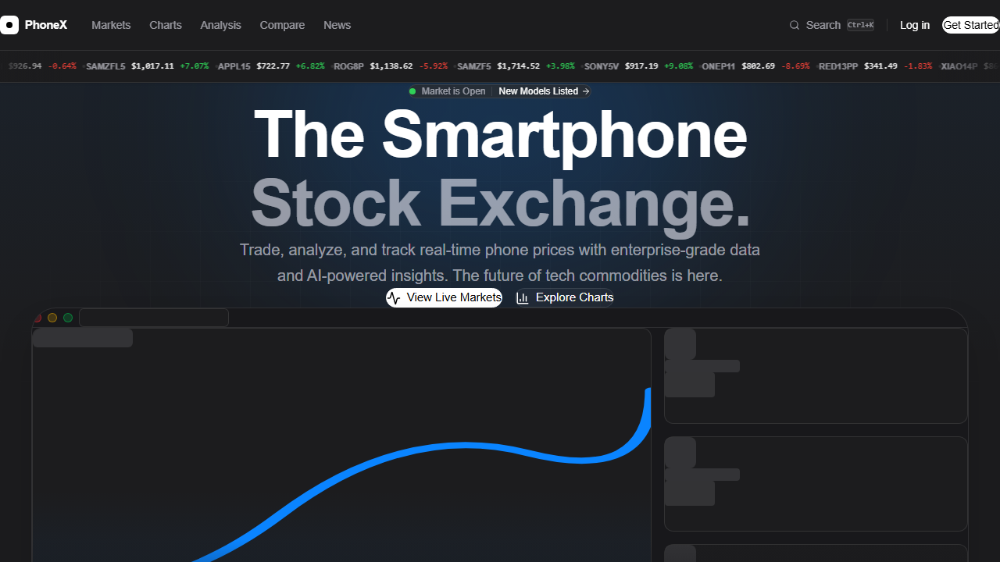

# PhoneX Market 📱📈

> **The world's first smartphone stock exchange powered by real-time data and AI.**

## 🚀 Live Demo
**Experience the live application here:** [https://phone-stock-market-hazel.vercel.app](https://phone-stock-market-hazel.vercel.app)

---

## 📖 Overview
PhoneX Market is a conceptual web application that treats smartphones like tradeable tech commodities. It allows users to track the "market value" of popular devices, analyze historical pricing trends, and review AI-driven market predictions. 

Whether you are a hobbyist tracking your next upgrade or an institution analyzing global tech supply chains, PhoneX provides enterprise-grade analytics in a clean, modern interface.

## ✨ Key Features
- **Live Market Dashboard:** Track over 40+ real-world flagship smartphones across major brands (Apple, Samsung, Google, Xiaomi, OnePlus, Sony, and Asus).
- **Interactive Price Charts:** View 24-hour historic price fluctuations, all-time highs, and daily volumes.
- **AI Market Predictions:** Advanced AI analysis provides 'BUY', 'SELL', or 'HOLD' signals based on hardware specs, market trends, and breaking news.
- **Breaking News Ticker:** Real-time news feed affecting smartphone valuations and market sentiment.
- **Premium Apple-Inspired UI/UX:** A fully modernized dark-mode interface featuring glassmorphism, system typography, and responsive grid layouts.

## 🛠️ Tech Stack
- **Framework:** [Next.js](https://nextjs.org/) (React)
- **Styling:** [Tailwind CSS](https://tailwindcss.com/)
- **Animations:** [Framer Motion](https://www.framer.com/motion/)
- **Charts:** [Recharts](https://recharts.org/)
- **Icons:** [Lucide React](https://lucide.dev/)
- **Deployment:** [Vercel](https://vercel.com/)

## 🚀 Getting Started

To run this project locally:

1. Clone the repository:
   `ash
   git clone https://github.com/youssef5520055/phone-stock-market.git
   `
2. Navigate into the directory:
   `ash
   cd phone-stock-market
   `
3. Install dependencies:
   `ash
   npm install
   `
4. Start the development server:
   `ash
   npm run dev
   `
5. Open [http://localhost:3000](http://localhost:3000) in your browser.

---
*Disclaimer: This is a conceptual mockup. Prices and stock market data are simulated for demonstration purposes.*
